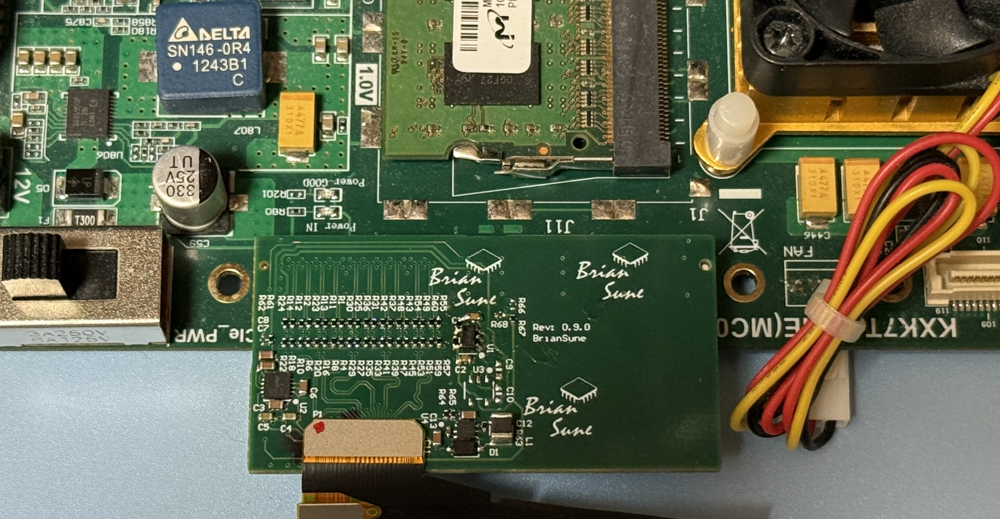
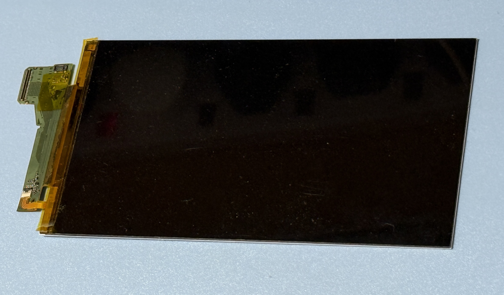
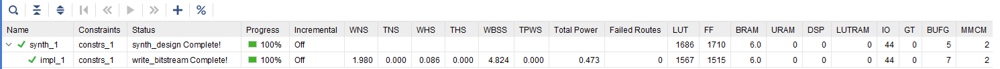

# Kintex 7 MIPI DSI 5.5" 4K AML (similar to SHARP) LCD

## If this project is constructive, welcome to donate a drink to PayPal.


or

paypal.me/briansune

# More MIPI DSI LCD examples

Please visit [FPGA-TFT-MIPI-or-DPI](https://briansune.github.io/FPGA-TFT-MIPI-or-DPI/)

# Background

In the past, many Xilinx FPGA developers and users wanted to utilize the "MIPI DSI TX Controller Subsystem" IP.

Unfortunately, due to the absence of LPDT, users were unable to initialize the LCD/TFT display. Hence, the usefulness of this built-in Vivado IP was highly limited.

In this project, a novel, ultra-low-resource, Verilog-based HDL design has been developed to address this niche need.

This design requires neither a softcore nor a hardcore (using only pure FSM + LUT), significantly reducing complexity.

Additionally, the design is independent of Vivado IP (excluding inherent FPGA building blocks) and does not require a DPHY IP either.

# Demonstration

## Test Patterns

|BPP,FPS,FPGA,Lanes,CFG|Video|
|:-:|:-:|
|24,60,K7,4+4,Scale-Up|[](https://youtube.com/video/PQL8EPnkkGI)|

### Remarks

```
The following demo is scaling up to 1080p, which is (2160/2,3840/2).

To demonstrate a proper 4K pixel LCD display a frame-buffer-compression(FBC) i.e. VESA DSC is required.

Such simple 1080p demon can directly reuse the existing MIPI-DSI video mode Verilog HDL-design.

This 1080p demo also act as a display sanity check.
```

### ToDo

```
Implement a FBC-based 4K demo.

The work of a VESA DSC is significantly complicated than the MIPI-DSI video mode itself.

Reference Paper: "Verilog implementation of the VESA DSC compression algorithm" [Carlos Alberto Pereira Ferreira](https://repositorio-aberto.up.pt/bitstream/10216/89000/2/170133.pdf)
```

# How to obtain the design?

Please contact via EMAIL: briansune@gmail.com

# How to Use?

1) Modify the Python script and convert the initialization LPDT ROM (read-only-memory)
2) Make sure the hardware is MIPI DSI supported. Xilinx FPGA please check [HERE](https://docs.amd.com/v/u/en-US/xapp894-d-phy-solutions) or Altera FPGA please check [HERE](https://cdrdv2-public.intel.com/666639/an754-683092-666639.pdf)
3) Make sure the MMCM and parameters are converged
4) Ensure the MIPI Mbps is lower than 900, which is tested on the 5.5 inch 1080p TFT 60 FPS.

# Hardware

|Description|EVM|
|:-:|:-:|
|FPGA K7||
|5.5" LCD||

# Project Resource

|BPP,FPS,FPGA,Lanes|Resources|
|:-:|:-:|
|24,60,K7,4+4||

# Project Heirachy

Remarks 1: Ultrascale+ devices and 7 series have different serialization building blocks.

Remarks 2: Ultrascale+ devices have MIPI physical interface, which no extra resistor-network or front-end ICs are needed.

Remarks 3: The only Verilog design that are changed to cope with Ultrascale+ device are the serialization and MMCM blocks.

```
 |-mipi_init_script
 | |-dtsi_4k_online.txt
 | |-four_lanes_lcd_init.txt
 | |-four_lanes_lcd_init_sharp_vm.txt
 | |-four_lanes_lcd_init_vm.txt
 | |-main.py
 | |-mipi_setup_rom.mem
 |-mipi_phys
 | |-mipi_crc.v
 | |-mipi_ecc.v
 | |-mipi_hs_clk_phy.v
 | |-mipi_hs_phy.v
 | |-mipi_lps_phy.v
 |-mipi_refclks
 | |-mipi_refclks.v
 |-mipi_setup
 | |-mipi_lpdt_setup.v
 | |-mipi_reset.v
 | |-mipi_setup_rom.mem
 |-mipi_sim
 | |-tb_mipi_setup.v
 | |-tb_mipi_top.v
 | |-tb_mipi_video.v
 |-mipi_top.v
 |-top.xdc
 |-video_src
 | |-mipi_long_vid_pack.v
 | |-mipi_remap.v
 | |-mipi_short_vid_hdr.v
 | |-mipi_video_stream.v
 | |-test_pattern_gen.v
 | |-video_timing_ctrl.v
```
